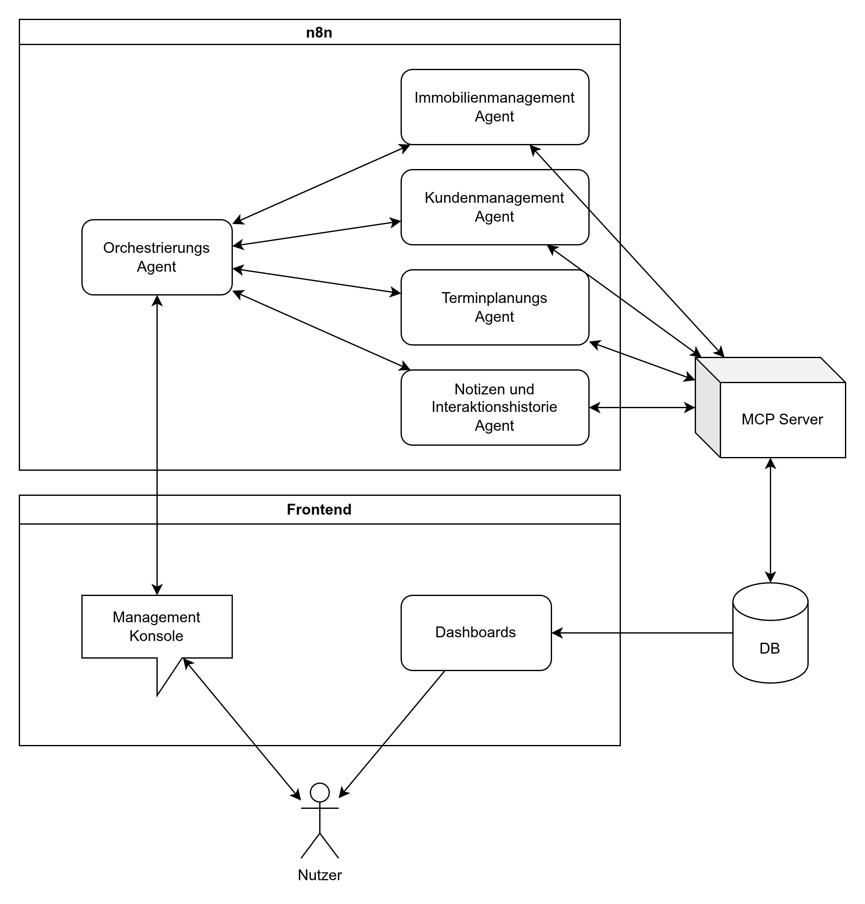

# Wochenendaufgabe

Bei diesem Projekt handelt es sich um die Wochenendaufgabe, bei welcher es um das Erstellen eines Multi-Agent Tools zum Unterstützen von Maklern geht.

## Aufbau



## Docker Compose

### n8n

```mkdir n8n```
```touch n8n.env```

In `n8n.env`:
```
GENERIC_TIMEZONE=Europe/Berlin
TZ=Europe/Berlin
N8N_RUNNERS_ENABLED=true
N8N_EDITOR_BASE_URL=https://127.0.0.1:5678
N8N_ENCRYPTION_KEY={{Sicheren Schlüssel einfügen}}
N8N_HOST_NAME=https://127.0.0.1:5678
N8N_HIRING_BANNER_ENABLED=false
N8N_HIDE_USAGE_PAGE=true
N8N_BASIC_AUTH_ACTIVE=true
N8N_BASIC_AUTH_USER=test
N8N_BASIC_AUTH_PASSWORD=test
N8N_ENFORCE_SETTINGS_FILE_PERMISSIONS=true
WEBHOOK_URL=https://127.0.0.1:5678
```

### mysql

```mkdir db```
```touch db.env```

In `db.env`:
```
MYSQL_ROOT_PASSWORD={{ROOT Passwort}}
MYSQL_USER={{User}}
MYSQL_PASSWORD={{Passwort}}
MYSQL_DATABASE=wochenendaufgabe
```

### Starten

```docker compose up -d```

Unter <http://localhost:5678> ist die n8n Instanz verfügbar.  
Hier die Flows aus `n8n_flows/` importieren und den Orchestrate Flow aktivieren.  
Eventuell müssen die Flows noch einmal richtig verknüpft werden.

## Python

### env

```touch .env```

In `.env`:
```
MYSQL_USER={{User}}
MYSQL_PASSWORD={{Passwort}}
MYSQL_DATABASE=wochenendaufgabe

DB_SERVER=localhost
DB_PORT=3306
```

### uv

```uv sync``` ausführen, um alle erforderlichen Pakete herunterzuladen und der Umgebung hinzuzufügen.

Als erstes wird mit `uv run ./init_db.py` die Datenbank initiert.

Anschließend mit `uv run ./mcp_server.py` den MCP-Server starten.  

Zusätzlich mit `uv run ./frontend/manage.py 8080` das Frontend auf Port 8080 starten. Dieses ist unter <http://localhost:8080> erreichbar.

## Evaluierung

Zuerst muss ein Makler in der Datenbank in der Tabelle `realtor` angelegt werden. Anschließend kann sich im Frontend mit dem vergebenen Vor- und Nachnamen eingeloggt werden.

Zum Testen der Aufgabe können nun die Prompts aus der Datei `prompts.txt` nacheinander im Anfragen-Tab eingegeben werden. Die Änderungen sind in den anderen Tabs sichtbar.